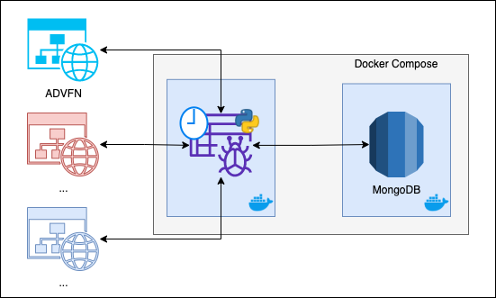

# WebScrapping ENJU3

Este projeto contem uma aplicação que realiza o processo de coleta de fatos e notícias a respeito da empresa [ENJI3](https://www.enjoei.com.br) nos diversos portais de notícias do mercado financeiro.

Atualmente, temos os seguintes portais integrados a solução:
- https://br.advfn.com/

Os dados são coletados, regularmente, por um *web scrapper* e armezenados em banco de dados MongoDB.



## Dependências

Este projeto utiliza as seguinte tecnologias:

- Python: linguagem de programação utilizada para implementação do scrapper utilizando as seguinte bibliotecas
  - ABC: para criação de classe abstrata do scrapper, que poderá ser implementada para novos portais/sites
  - Logging: para criação de logs da aplicação
  - Requests: para realizar as requisições aos sites
  - PyMongo: para interagir com o MongoDB
  - BS4: para interagir com o conteúdo HTML da página
- Docker: para encapsular tanto aplicação de scrapping quanto o banco MongoDB
- Docker Compose: para orquestração dos contêineres do serviço

## Como executar

Para a execução deste projeto se faz necessário as instalação do docker e do docker-compose.

Executando o comando abaixo serão provisionados todos os containeres do serviço <strike>(ou assim deveria)</strike>, o MongoDB ficará exposto na porta 27018 da sua máquina e, após a primeira execução do scrapper, os dados capturado deverão estar disponíveis no database *scraper* na collection *enju3*.

```bash
docker-compose up
```

## Trabalhos Futuros

1. Implementar lógica para não persistir notícias já persisitidas

2. Implementar scrapper para os comentários das notícias

3. Limpeza e tokenização do título e corpo das notícias e dos comentário

4. Análise de sentimento da notícia e dos comentários

   


 